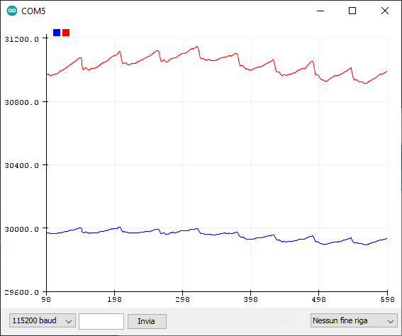

[](https://github.com/n-elia/MAX30102-MicroPython-driver/actions/workflows/python-publish.yml)
[](https://github.com/n-elia/MAX30102-MicroPython-driver/actions/workflows/pre-compile.yml)
[](https://badge.fury.io/py/micropython-max30102)


# Maxim MAX30102 MicroPython driver

A port of the SparkFun driver for Maxim MAX30102 sensor to MicroPython.

It _should_ work for MAX30105, too. If you have the chance to test this library with a MAX30105, please leave your
feedback in the Discussions section.

## Table of contents

- [Maxim MAX30102 MicroPython driver](#maxim-max30102-micropython-driver)
  - [Disclaimer](#disclaimer)
  - [Usage](#usage)
    - [1 - Including this library into your project](#1---including-this-library-into-your-project)
      - [1a - **network-enabled MicroPython ports**](#1a---network-enabled-micropython-ports)
      - [1b - **manual way** (no Internet access required)](#1b---manual-way-no-internet-access-required)
    - [2 - I2C setup and sensor configuration](#2---i2c-setup-and-sensor-configuration)
      - [I2C connection](#i2c-connection)
      - [Sensor setup](#sensor-setup)
    - [3 - Data acquisition](#3---data-acquisition)
      - [Read data from sensor](#read-data-from-sensor)
      - [Notes on data acquisition rate](#notes-on-data-acquisition-rate)
      - [Die temperature reading](#die-temperature-reading)
  - [Changelog](#changelog)
  - [Acknowledgements](#acknowledgements)
  - [Tested platforms](#tested-platforms)
  - [Other useful things and troubleshooting](#other-useful-things-and-troubleshooting)
    - [Realtime plot over Serial](#realtime-plot-over-serial)
    - [Sensor clones](#sensor-clones)
    - [Heartrate and SPO2 estimation](#heartrate-and-spo2-estimation)
    - [ESP8266 module import error](#esp8266-module-import-error)

## Disclaimer

This work is not intended to be used in professional environments, and there are no guarantees on its functionalities.
Please do not rely on it for medical purposes or professional usage.

## Usage

Driver usage is quite straightforward. You just need to import the library, and to set up a `SoftI2C` instance.

A full example is provided in `/examples/basic_usage` directory.

### 1 - Including this library into your project

#### 1a - **network-enabled MicroPython ports**

> Warning: in latest MicroPython releases `upip` has been deprecated in favor
> of [`mip`](https://docs.micropython.org/en/latest/reference/packages.html#package-management). This module is
> compatible
> with both of them. Please use the package manager included into your MicroPython version.

If your MicroPython version supports `mip` package manager, put these lines **after** the setup of an Internet
connection:

```python
import mip

mip.install("github:n-elia/MAX30102-MicroPython-driver")
```

If your MicroPython version supports `upip` package manager, put these lines **after** the setup of an Internet
connection:

```python
import upip

upip.install("micropython-max30102")
```

To run the example in `./example` folder, please set your WiFi credentials in `boot.py` and then upload `./example`
content into your microcontroller. If you prefer, you can perform a manual install as explained below.

#### 1b - **manual way** (no Internet access required)

To directly include the library into a MicroPython project, it's sufficient to copy `max30102/circular_buffer.py`
and `max30102/__init__.py`, into the `lib/max30102` directory.

The folder tree of your device should look as follows:

```text
.
┣ 📜 boot.py
┣ 📜 main.py
┗ 📂 lib
  ┗ 📂 max30102
    ┣ 📜 __init__.py
    ┗ 📜 circular_buffer.py
```

Then, import the constructor as follows:

```python
from max30102 import MAX30102
```

To run the example in `./examples/basic_usage` folder, copy `max30102/circular_buffer.py` and `max30102/__init__.py` into
the `./examples/basic_usage/lib/max30102` directory. Then, upload the `./examples/basic_usage` directory content into your microcontroller. After the
upload, press the reset button of your board are you're good to go.

### 2 - I2C setup and sensor configuration

#### I2C connection

Create a `SoftI2C` instance as in the following example:

```python
from machine import SoftI2C, Pin

my_SDA_pin = 21  # I2C SDA pin number here!
my_SCL_pin = 22  # I2C SCL pin number here!
my_i2c_freq = 400000  # I2C frequency (Hz) here!

i2c = SoftI2C(sda=Pin(my_SDA_pin),
              scl=Pin(my_SCL_pin),
              freq=my_i2c_freq)

sensor = MAX30102(i2c=i2c)
```

The I2C pin numbers depend on the board that you are using, and how you wired the sensor to it.

#### Sensor setup

The library provides a method to setup the sensor at once. Leaving the arguments empty, makes the library load the
default values.

> **Default configuration values:**
>
> _Led mode_: 2 (RED + IR)  
> _ADC range_: 16384  
> _Sample rate_: 400 Hz  
> _Led power_: maximum (50.0mA - Presence detection of ~12 inch)  
> _Averaged samples_: 8  
> _Pulse width_: 411

```python
# Setup with default values
sensor.setup_sensor()

# Alternative example:
setup_sensor(self, led_mode=2, adc_range=16384, sample_rate=400)
```

The library provides the methods to change the configuration parameters one by one, too. Remember that
the `setup_sensor()` method has still to be called before modifying the single parameters.

```python
# Set the number of samples to be averaged by the chip
SAMPLE_AVG = 8  # Options: 1, 2, 4, 8, 16, 32
sensor.set_fifo_average(SAMPLE_AVG)

# Set the ADC range
ADC_RANGE = 4096  # Options: 2048, 4096, 8192, 16384
sensor.set_adc_range(ADC_RANGE)

# Set the sample rate
SAMPLE_RATE = 400  # Options: 50, 100, 200, 400, 800, 1000, 1600, 3200
sensor.set_sample_rate(SAMPLE_RATE)

# Set the Pulse Width
PULSE_WIDTH = 118  # Options: 69, 118, 215, 411
sensor.set_pulse_width(PULSE_WIDTH)

# Set the LED mode
LED_MODE = 2  # Options: 1 (red), 2 (red + IR), 3 (red + IR + g - MAX30105 only)
sensor.set_led_mode(LED_MODE)

# Set the LED brightness of each LED
LED_POWER = MAX30105_PULSEAMP_MEDIUM
# Options:
# MAX30105_PULSE_AMP_LOWEST =  0x02 # 0.4mA  - Presence detection of ~4 inch
# MAX30105_PULSE_AMP_LOW =     0x1F # 6.4mA  - Presence detection of ~8 inch
# MAX30105_PULSE_AMP_MEDIUM =  0x7F # 25.4mA - Presence detection of ~8 inch
# MAX30105_PULSE_AMP_HIGH =    0xFF # 50.0mA - Presence detection of ~12 inch
sensor.set_pulse_amplitude_red(LED_POWER)
sensor.set_pulse_amplitude_it(LED_POWER)
sensor.set_pulse_amplitude_green(LED_POWER)

# Set the LED brightness of all the active LEDs
LED_POWER = MAX30105_PULSEAMP_MEDIUM
# Options:
# MAX30105_PULSE_AMP_LOWEST =  0x02 # 0.4mA  - Presence detection of ~4 inch
# MAX30105_PULSE_AMP_LOW =     0x1F # 6.4mA  - Presence detection of ~8 inch
# MAX30105_PULSE_AMP_MEDIUM =  0x7F # 25.4mA - Presence detection of ~8 inch
# MAX30105_PULSE_AMP_HIGH =    0xFF # 50.0mA - Presence detection of ~12 inch
sensor.set_active_leds_amplitude(LED_POWER)
```

### 3 - Data acquisition

The sensor will store all the readings into a FIFO register (FIFO_DATA). Based on the number of active LEDs and other
configuration parameters, the sensor instance will read data from that register, putting it into the_storage_.
The_storage_ is a circular buffer, that can be read using the provided methods.

The `check()` method polls the sensor to check if new samples are available in the FIFO queue. If data is available, it
will be read and put into the _storage_. We can access those samples using the provided methods such
as `popRedFromStorage()`.

#### Read data from sensor

As a consequence, this is an example on how the library can be used to read data from the sensor:

```python
while (True):
    # The check() method has to be continuously polled, to check if
    # there are new readings into the sensor's FIFO queue. When new
    # readings are available, this function will put them into the storage.
    sensor.check()

    # Check if the storage contains available samples
    if (sensor.available()):
        # Access the storage FIFO and gather the readings (integers)
        red_sample = sensor.pop_red_from_storage()
        ir_sample = sensor.pop_ir_from_storage()

        # Print the acquired data (can be plot with Arduino Serial Plotter)
        print(red_sample, ",", ir_sample)
```

#### Notes on data acquisition rate

Considering the sensor configuration, two main parameters will affect the data throughput of the sensor itself:

- The *sample rate*, which is the number of RAW readings per second made by the sensor

- The *averaged samples*, which is the number of RAW readings averaged together for composing a single sample

Therefore, the FIFO_DATA register will contain averaged RAW readings. The rate at which that register is fed depends on
the two parameters: *real rate = sample rate / averaged samples*.

The library computes this value, that can be accessed with:

```python
# Get the estimated acquisition rate
acquisition_rate = sensor.get_acquisition_frequency()
```

However, there are some limitations on sensor side and on micropocessor side that may affect the acquisition rate (see
issue #6 for more details about it). Is is possible to measure the real throughput as
in [this](https://github.com/sparkfun/SparkFun_MAX3010x_Sensor_Library/blob/72d5308df500ae1a64cc9d63e950c68c96dc78d5/examples/Example9_RateTesting/Example9_RateTesting.ino)
example sketch by SparkFun, using the following snippet:

```python
# (Assuming that the sensor instance has been already set-up)
from utime import ticks_diff, ticks_ms

t_start = ticks_us()  # Starting time of the acquisition
samples_n = 0  # Number of samples that have been collected

while True:
    sensor.check()
    if sensor.available():
        red_reading = sensor.pop_red_from_storage()
        ir_reading = sensor.pop_ir_from_storage()

        # Print the acquired data (so that it can be plotted with a Serial Plotter)
        print(red_reading, ",", ir_reading)

        # Compute the real frequency at which we receive data (with microsecond precision)
        if compute_frequency:
            if ticks_diff(ticks_us(), t_start) >= 999999:
                f_HZ = samples_n
                samples_n = 0
                print("acquisition frequency = ", f_HZ)
                t_start = ticks_us()
            else:
                samples_n = samples_n + 1
```

#### Die temperature reading

The `read_temperature()` method allows to read the internal die temperature. An example is proposed below.

```python
# Read the die temperature in Celsius degree
temperature_C = sensor.read_temperature()
print("Die temperature: ", temperature_C, "°C")
```

Note: as stated in the [datasheet](https://datasheets.maximintegrated.com/en/ds/MAX30102.pdf), the internal die
temperature sensor is intended for calibrating the temperature dependence of the SpO2 subsystem. It has an inherent
resolution of 0.0625°C, but be aware that the accuracy is ±1°C.

## Changelog

- v0.4.2
    - Added an heartrate estimation example.
    - Issued a new release to update the PyPi docs.
- v0.4.1
    - Changed the module files organization.
    - Added support to `mip` package manager.
- v0.4.0
    - According to some best practices discussed [here](https://forum.micropython.org/viewtopic.php?f=2&t=12508), some
      changes have been made.
        - Removed the I2C scan at instantiation time, so that the sensor object could be instantiated even if the sensor
          is not available at the moment.
        - Removed the part ID checks at instantiation time, so that the user may skip them saving time.
    - The example has been updated.
- v0.3.6
    - The library now performs a I2C scan to check if the sensor is connected. This prevents unexpected I2C errors with
      some boards (such as Raspberry Pi Pico).
- v0.3.5
    - A `SoftI2C` instance is now required by the constructor.
    - The constructor now raises `RuntimeError` when the sensor is not found on I2C bus.
    - The example has been updated to intercept the errors thrown by the constructor.
    - The example has been updated to estimate real acquisition frequency with a precision of 1 microsecond.
    - The readme has been re-organized to improve readability.
- v0.3.4
    - The package has been refactored to be compliant to PEP standards.
- v0.3.3
    - Made a PyPi package. Now you can install this package with upip.
    - Tested with Raspberry Pi Pico and non-genuine sensors.
- v0.3
    - Tested with TinyPico board (based on ESP32-D4) and genuine Maxim MAX30102 sensor.

## Acknowledgements

This work is a lot based on:

- [SparkFun MAX3010x Sensor Library](https://github.com/sparkfun/SparkFun_MAX3010x_Sensor_Library "GitHub | SparkFun MAX3010x Sensor Library")

  Written by **Peter Jansen** and **Nathan Seidle** (SparkFun)
  This is a library written for the Maxim MAX30105 Optical Smoke Detector
  It should also work with the MAX30102. However, the MAX30102 does not have a Green LED.
  These sensors use I2C to communicate, as well as a single (optional)
  interrupt line that is not currently supported in this driver.
  Written by Peter Jansen and Nathan Seidle (SparkFun)
  BSD license, all text above must be included in any redistribution.

- [esp32-micropython](https://github.com/kandizzy/esp32-micropython/blob/master/PPG/ppg/MAX30105.py "GitHub | esp32-micropython")

  A port of the library to MicroPython by **kandizzy**

## Tested platforms

- _TinyPico_ (board based on _ESP32-D4_) running 'tinypico-20210418-v1.15.bin' MicroPython firmware, connected to a
  genuine Maxim 30102 breakout
  board ([MAXREFDES117#](https://www.maximintegrated.com/en/design/reference-design-center/system-board/6300.html)).

- _Raspberry Pi
  Pico_ + non-Maxim breakout board ([thanks to ebolisa](https://github.com/n-elia/MAX30102-MicroPython-driver/issues/4))

- _ESP32-S3_ (_Unexpected Maker TinyS3_) running MicroPython v1.18 stable and MicroPython v1.19 stable + non-Maxim
  breakout board.

**I2C read issue**: as discussed in the [MicroPython forum](https://forum.micropython.org/viewtopic.php?f=2&t=12508) and
in the
[GitHub Discussions section](https://github.com/n-elia/MAX30102-MicroPython-driver/discussions/5#discussioncomment-2899588)
,
some board/sensor combinations lead to an issue that makes the first I2C read fail. This issue can be mitigated by
running an I2C scan before actually using the sensor, as shown in the provided example.

## Other useful things and troubleshooting

### Realtime plot over Serial

The example proposed in this repository ([main.py](./examples/basic_usage/main.py)) contains a print statement in a CSV-like
format: `print(red_reading, ",", IR_reading)`. If you open Arduino IDE and connect your board, then you will be able to
open the *serial plotter* (Ctrl+Maiusc+L) and see a real-time plot of your readings (need some help? take a
look [here](https://learn.sparkfun.com/tutorials/max30105-particle-and-pulse-ox-sensor-hookup-guide/all)).

For instance, this is an example of my heartbeat taken on the index finger:



### Sensor clones

There is an issue involving chinese clones of the Maxim MAX30102: some of them appear to have the red and IR registers
inverted (or maybe the LEDs swapped) (see [here](https://github.com/aromring/MAX30102_by_RF/issues/13)). You can easily
check if your sensor is inverted by putting it in LED mode 1: only the red LED should work. If you see the IR LED (use
your phone camera to check), then you have to collect IR samples as red ones and viceversa.

### Heartrate and SPO2 estimation

If you're looking for algorithms for extracting heartrate and SPO2 from your RAW data, take a
look [here](https://github.com/aromring/MAX30102_by_RF)
and [here](https://github.com/kandizzy/esp32-micropython/tree/master/PPG).

A basic example of heartrate detection is also available in `./examples/heart_rate`.

### ESP8266 module import error

If you get an error like this:

```
MemoryError: memory allocation failed,allocating 416 bytes
```

then your heap is too small to allocate the module. You can try to pre-compile the module using `mpy-cross` and then
import it as usual. You can either use the precompiled module provided in
the [GitHub Action artifacts](https://github.com/n-elia/MAX30102-MicroPython-driver/actions/workflows/pre-compile.yml)
or compile ityourself.

In the first case, you just have to replace the `max30102` folder of the module with the one provided in the artifact
archive.

In either case, you have to choose the proper version of `mpy-cross` according to your Micropython version: for
MicroPython v.1.18 and below, you can use `mpy-cross-v5`, while for MicroPython v1.19 you have to use `mpy-cross-v6`.

More information is provided into [this](https://github.com/n-elia/MAX30102-MicroPython-driver/pull/19) pull request.
